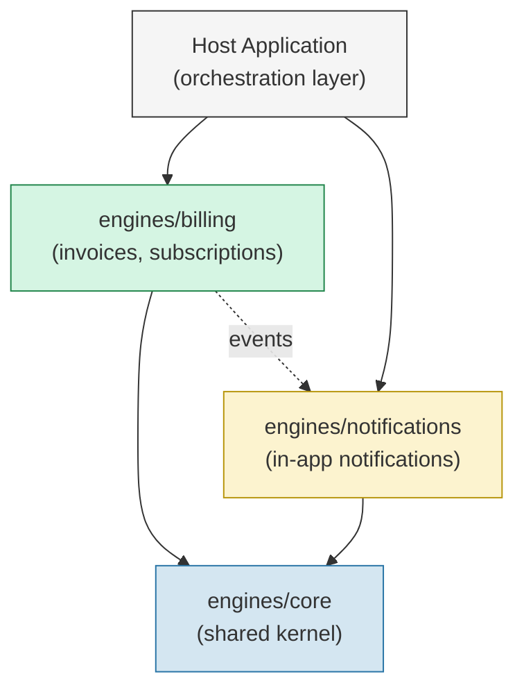

# Orbit — Companion Application

The companion Rails application for the book [**Modular Rails: Architecture for the Long Game**](https://github.com/Davidslv/ruby-architecture) by David Silva.

Orbit is a simplified SaaS platform that manages subscriptions, generates invoices, and sends notifications to customers. It starts as a standard Rails monolith and gets progressively modularised through the book, demonstrating how to decompose a Rails application into well-isolated engines.

## Architecture

```
orbit/
├── app/                  # Host application (thin orchestration layer)
├── engines/
│   ├── core/             # Shared kernel — cross-cutting concerns
│   ├── billing/          # Invoices, subscriptions, plans
│   └── notifications/    # In-app notifications
└── config/               # Host configuration wires engines together
```



## Prerequisites

- Ruby 3.4+
- PostgreSQL 14+
- Bundler 2.5+

## Setup

```bash
git clone https://github.com/Davidslv/orbit.git
cd orbit

bundle install

bin/rails db:create db:migrate db:seed

bin/rails server
```

## Running Tests

```bash
# Host application tests
bundle exec rspec

# Individual engine tests
cd engines/billing && bundle exec rspec
cd engines/notifications && bundle exec rspec

# All engine tests from the root
bin/rails test
```

## Key Patterns Demonstrated

- **Namespace isolation** -- Each engine uses `isolate_namespace` to prevent accidental coupling
- **Configurable base controllers** -- Engines inherit from a configurable parent controller
- **Event-driven communication** -- Billing publishes events, Notifications subscribes via `ActiveSupport::Notifications`
- **Concern-based integration** -- Engines expose concerns (`Billable`, `Notifiable`) included by host models
- **Shared kernel** -- Core engine provides cross-cutting concerns like `Auditable`
- **Background jobs** -- Event subscribers enqueue jobs instead of processing inline
- **Authorization policies** -- Plain Ruby policy objects without external dependencies
- **API endpoints** -- Versioned JSON API within engine boundaries
- **i18n per engine** -- Each engine owns its locale files

## The Book

This application is the practical companion to *Modular Rails: Architecture for the Long Game*. Each chapter references specific files and patterns in this codebase. The book covers:

- **Part I** -- Clean Architecture, trade-off analysis, and XP principles applied to Rails
- **Part II** -- How Rails Engines work internally and how to build them
- **Part III** -- Extracting engines, managing dependencies, data ownership, testing, team workflows
- **Part IV** -- When engines are wrong, microservices, and evolving your architecture

Book repository: [github.com/Davidslv/ruby-architecture](https://github.com/Davidslv/ruby-architecture)

## License

The code in this repository is licensed under the [MIT License](LICENSE).
